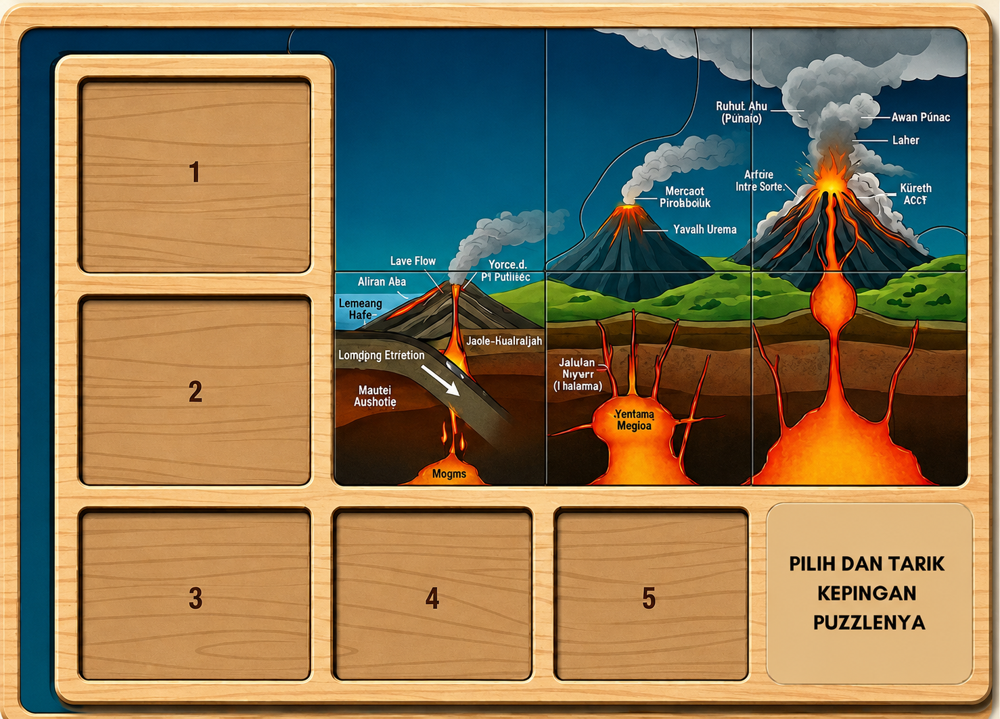

# GeoPuzzle: Disaster Mitigation & Geology Educational Game 🌋🌊⛰️

**GeoPuzzle** adalah sebuah platform edukasi interaktif berbasis web yang dirancang untuk meningkatkan kesadaran dan pengetahuan masyarakat Indonesia mengenai mitigasi bencana geologi melalui pengalaman bermain puzzle yang seru dan edukatif.



## 🚀 Fitur Utama

- **Modul Bencana Lengkap**:
  - **Gunung Api (Volcano)**: Pelajari proses subduksi, akumulasi magma, hingga tahap-tahap erupsi dan level mitigasi PVMBG.
  - **Tsunami**: Memahami mekanisme pemicu tsunami dari gempa bumi hingga longsor bawah laut.
  - **Tanah Longsor (Landslide)**: Strategi pencegahan longsor melalui rekayasa landscape dan vegetasi.
- **Mekanik Puzzle Interaktif**:
  - **Fill-in-the-Blank**: Menguji pemahaman istilah-istilah geologi.
  - **Board-Style Drag & Drop**: Menyusun kepingan puzzle langsung di atas papan infografis dengan presisi tinggi.
  - **Matching & Classification**: Memasangkan tindakan mitigasi dengan level kesiagaan bencana yang tepat.
- **Visual Premium & Responsif**:
  - Desain bertema *Earth-Tone* yang menyejukkan mata.
  - Efek *Glassmorphism* dan animasi mikro yang modern.
  - Sepenuhnya responsif untuk perangkat mobile, tablet, dan desktop.

## 🛠️ Tech Stack

- **Framework**: [Next.js 14 (App Router)](https://nextjs.org/)
- **Language**: [TypeScript](https://www.typescriptlang.org/)
- **Styling**: [Tailwind CSS](https://tailwindcss.com/)
- **Drag & Drop**: [@dnd-kit](https://dnd-kit.com/)
- **Animations**: [Framer Motion](https://www.framer.com/motion/)
- **State Management**: [Zustand](https://github.com/pmndrs/zustand)

## 📦 Instalasi & Penggunaan

1. **Clone repositori**:
   ```bash
   git clone https://github.com/MarioSitepu/geopuzzle.git
   ```

2. **Install dependensi**:
   ```bash
   npm install
   ```

3. **Jalankan server pengembangan**:
   ```bash
   npm run dev
   ```

4. **Buka di browser**:
   Akses [http://localhost:3000](http://localhost:3000) untuk mulai bermain.

## 📂 Struktur Proyek

- `/src/app`: Routing dan layouting utama menggunakan Next.js App Router.
- `/src/components`: Komponen UI modular, termasuk engine puzzle utama.
- `/src/components/puzzles`: Implementasi logika khusus untuk berbagai tipe puzzle (Fill-the-blank, Classification, dll).
- `/src/store`: Manajemen state global untuk skor dan progres permainan.
- `/public/images`: Aset gambar infografis dan kepingan puzzle yang dikalibrasi secara presisi.

## 📝 Konten Edukasi

Konten dalam game ini merujuk pada standar mitigasi bencana di Indonesia, termasuk klasifikasi level kesiagaan gunung api oleh **PVMBG (Pusat Vulkanologi dan Mitigasi Bencana Geologi)**:
- **Level 1 (Normal)**: Beraktivitas seperti biasa.
- **Level 2 (Waspada)**: Peningkatan kewaspadaan & menjaga radius aman.
- **Level 3 (Siaga)**: Persiapan evakuasi.
- **Level 4 (Awas)**: Evakuasi segera ke tempat aman.

## 🤝 Kontribusi

Kontribusi sangat terbuka untuk pengembangan fitur baru atau penambahan konten mitigasi bencana lainnya. Silakan lakukan *Pull Request* atau hubungi tim pengembang.

---
Dikembangkan dengan ❤️ untuk Indonesia yang lebih tangguh bencana.
